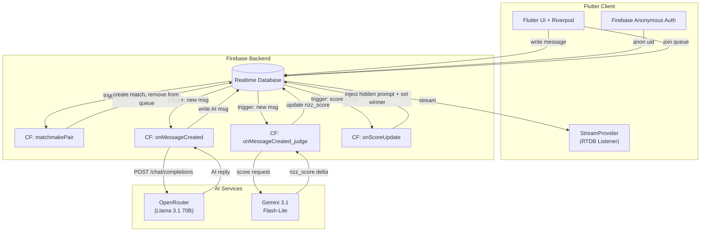

# RizzRank "Date Race" -- Multiplayer Architecture Plan

## Architecture Overview




### The "Date Race" Game Loop

1. Two players join a matchmaking queue (anonymous Firebase Auth).
2. A Cloud Function pairs them into a match, each assigned their own private chat lane with the **same AI character**.
3. Both players chat simultaneously. Each message triggers two Cloud Functions in parallel:
  - **OpenRouter CF**: Sends history to Llama 3.1 70B, writes AI reply back to the player's message path.
  - **Gemini Judge CF**: Sends the latest exchange to Gemini Flash-Lite, receives a score delta, updates `rizz_score`.
4. The client shows a real-time "Heart Meter" for the player and a "Ghost Meter" showing the opponent's progress.
5. When `rizz_score > 100`, the next OpenRouter call gets a hidden system injection: *"The user has won your heart. Find an in-character way to ask them on a date now."*
6. When the AI's date-ask response is detected (via keyword heuristic in the Cloud Function), `is_winner` is set to `true`, `match.status` becomes `"completed"`, and `match.winner_uid` is written.
7. Both clients react to the status change -- winner sees the Victory screen, loser sees a "Better luck next time" screen.

---

## Phase 1: Clean Slate and Firebase Core

### 1.1 Dependency Overhaul

**Remove from `pubspec.yaml`:**

- `isar: ^3.1.0+1`
- `isar_flutter_libs: ^3.1.0+1`
- `google_generative_ai: ^0.4.7` (Gemini now lives in Cloud Functions, not the client)
- `sqflite: ^2.4.2`
- `path_provider: ^2.1.5` (no longer needed for DB paths)
- Dev: `isar_generator: ^3.1.0+1`, `build_runner: ^2.4.13`

**Add to `pubspec.yaml`:**

- `firebase_core: ^3.12.1`
- `firebase_auth: ^5.5.2`
- `firebase_database: ^11.3.3`
- `cloud_functions: ^5.3.3`
- `go_router: ^15.1.2` (for declarative routing)

**Keep as-is:**

- `flutter_riverpod`, `lucide_icons`, `google_fonts`, `animations`, `cupertino_icons`

**Delete files that depend on Isar:**

- `lib/features/auth/domain/user_model.dart` (will be recreated as Firebase model)
- `lib/features/matchmaking/domain/match_model.dart` (will be recreated)
- `test/unit/models_test.dart` (will be rewritten)
- `bin/test_gemini.dart` (Gemini no longer called from client)

**Run:** `flutter pub get` after edits.

### 1.2 Firebase Project Setup

Create a Firebase project (or use existing). Enable:

- **Anonymous Authentication** (Authentication > Sign-in method > Anonymous)
- **Realtime Database** (create in `us-central1`, start in locked mode)
- **Cloud Functions** (Blaze plan required)

Run from project root:

```bash
# Install Firebase CLI if needed
dart pub global activate flutterfire_cli
flutterfire configure --project=<firebase-project-id>
```

This generates `lib/firebase_options.dart`. Also run:

```bash
cd rizzrank
firebase init functions  # Select Node.js / TypeScript
firebase init database   # Creates database.rules.json
```

This creates the `functions/` directory at project root.

### 1.3 RTDB Path Architecture

**Target file**: `database.rules.json` (initial structure reference)

```
rizzrank-rtdb/
|
+-- users/
|   +-- {uid}/
|       +-- display_name: string
|       +-- elo: number (default 1000)
|       +-- wins: number
|       +-- losses: number
|       +-- total_matches: number
|       +-- created_at: number (timestamp)
|
+-- matchmaking_queue/
|   +-- {uid}/
|       +-- display_name: string
|       +-- elo: number
|       +-- timestamp: number (ServerValue.timestamp)
|
+-- matches/
|   +-- {matchId}/
|       +-- status: "waiting" | "active" | "completed"
|       +-- ai_character_id: string ("luna" | "atlas" | "zephyr")
|       +-- created_at: number
|       +-- winner_uid: string | null
|       +-- players/
|           +-- {uid}/
|               +-- display_name: string
|               +-- rizz_score: number (starts 0)
|               +-- is_winner: boolean (default false)
|               +-- messages/
|                   +-- {pushId}/
|                       +-- role: "user" | "model" | "system"
|                       +-- text: string
|                       +-- timestamp: number
|                       +-- rizz_delta: number | null
```

Key design decisions:

- Each player's `messages/` path is **private** -- Player A cannot read Player B's chat. Enforced via security rules.
- `rizz_score` lives at the player level, updated atomically by the Judge CF via `transaction`.
- `match.status` and `match.winner_uid` are the shared state both clients listen to for game-over detection.

### 1.4 Data Models (Firebase-Ready)

**Target file**: `lib/core/models/user_model.dart`

```dart
class AppUser {
  final String uid;
  final String displayName;
  final int elo;
  final int wins;
  final int losses;
  final int totalMatches;

  factory AppUser.fromSnapshot(DataSnapshot snapshot) { ... }
  Map<String, dynamic> toMap() { ... }
}
```

**Target file**: `lib/core/models/match_model.dart`

```dart
class GameMatch {
  final String matchId;
  final String status;        // "waiting" | "active" | "completed"
  final String aiCharacterId;
  final String? winnerUid;
  final Map<String, PlayerState> players;

  factory GameMatch.fromSnapshot(DataSnapshot snapshot) { ... }
}

class PlayerState {
  final String uid;
  final String displayName;
  final int rizzScore;
  final bool isWinner;

  factory PlayerState.fromSnapshot(DataSnapshot snapshot) { ... }
}
```

**Target file**: `lib/core/models/chat_message.dart`

```dart
class ChatMessage {
  final String? key;  // Firebase push ID
  final String role;  // "user" | "model"
  final String text;
  final int timestamp;
  final int? rizzDelta;

  factory ChatMessage.fromSnapshot(DataSnapshot snapshot) { ... }
  Map<String, dynamic> toMap() { ... }
}
```

### 1.5 Bootstrap `main.dart`

**Target file**: `lib/main.dart`

Replace the current counter app entirely:

```dart
void main() async {
  WidgetsFlutterBinding.ensureInitialized();
  await Firebase.initializeApp(options: DefaultFirebaseOptions.currentPlatform);
  runApp(const ProviderScope(child: RizzRankApp()));
}
```

`RizzRankApp` uses the `AppTheme` (Phase 3) and `GoRouter` for navigation.

---

## Phase 2: The AI Pipeline (Cloud Functions)

### 2.1 Cloud Functions Project Setup

**Target directory**: `functions/`

`**functions/package.json`** dependencies:

- `firebase-admin`, `firebase-functions`
- `node-fetch` or built-in `fetch` (Node 18+) for OpenRouter HTTP calls
- `@google/genai` for Gemini Judge calls

`**functions/src/index.ts`** exports:

1. `matchmakePair` -- RTDB trigger on `matchmaking_queue`
2. `onMessageCreated` -- RTDB trigger on `matches/{matchId}/players/{uid}/messages/{msgId}` (role === "user")
3. `onScoreUpdate` -- RTDB trigger on `matches/{matchId}/players/{uid}/rizz_score`

### 2.2 AI Characters (Shared Constants)

**Target file**: `functions/src/characters.ts`

Port the 3 characters from [rizzrank-mockup/src/services/geminiService.ts](rizzrank-mockup/src/services/geminiService.ts) (lines 15-41). Same IDs (`luna`, `atlas`, `zephyr`), same system instructions, same descriptions. These are used by both OpenRouter (for chat) and Gemini (for scoring context).

**Also create**: `lib/core/data/ai_characters.dart` (Flutter-side copy for UI display -- avatar URLs, names, roles, descriptions only; no system prompts on client).

### 2.3 The OpenRouter Chat Service (Cloud Function)

**Target file**: `functions/src/openRouterService.ts`
**Source of Truth (conversation structure)**: [rizzrank-mockup/src/pages/ChatPage.tsx](rizzrank-mockup/src/pages/ChatPage.tsx) lines 38-45 (history format) and [rizzrank-mockup/src/services/geminiService.ts](rizzrank-mockup/src/services/geminiService.ts) lines 43-54 (system instruction pattern)

**Trigger**: `onMessageCreated` -- fires when a new child is written to `matches/{matchId}/players/{uid}/messages` where `role === "user"`.

Logic:

1. Read the match's `ai_character_id` to get the character's `systemInstruction`.
2. Read the player's current `rizz_score`. If `> 100`, append a hidden system message to the prompt: `"[HIDDEN INSTRUCTION]: The user has completely won your heart. You are smitten. Find a natural, in-character way to ask them out on a date right now. Be direct about it."`.
3. Read all messages in the player's path, ordered by timestamp.
4. Build the OpenRouter payload:

```typescript
const payload = {
  model: "meta-llama/llama-3.1-70b-instruct",
  messages: [
    { role: "system", content: systemInstruction + (hiddenInjection || "") },
    ...history.map(m => ({ role: m.role, content: m.text }))
  ],
  temperature: 0.9,
  max_tokens: 300
};
```

1. `POST` to `https://openrouter.ai/api/v1/chat/completions` with `Authorization: Bearer ${OPENROUTER_API_KEY}`.
2. Write the AI response as a new message under the same player's `messages/` path with `role: "model"`.
3. **Date-ask detection**: After writing the AI response, run a keyword check. If the response contains date-related phrases (e.g., "go out with me", "grab coffee", "would you like to go on a date", "let me take you out"), AND `rizz_score > 100`, set `players/{uid}/is_winner: true` and `match.winner_uid: uid` and `match.status: "completed"`.

**Environment config**: `firebase functions:config:set openrouter.key="sk-or-..."`.

### 2.4 The Gemini Judge (Cloud Function)

**Target file**: `functions/src/geminiJudge.ts`

**Trigger**: Same `onMessageCreated` trigger (or a separate function on the same path). Fires on **every new message** (both user and model) to score the exchange.

Logic:

1. Read the last 2 messages (the user message + context) from the player's path.
2. Build a scoring prompt for Gemini:

```
You are a dating coach AI judge. Score the following message on a "rizz scale" from 0 to 15.
- 0-3: Boring, generic, no charm.
- 4-7: Decent effort, some personality.
- 8-12: Smooth, witty, emotionally intelligent.
- 13-15: Exceptional. Masterclass in charm.

Only respond with a single integer. No explanation.

Character context: {character.description}
AI's last message: "{lastAIMessage}"
User's message: "{userMessage}"

Score:
```

1. Call Gemini 3.1 Flash-Lite via `@google/genai`:

```typescript
const model = genAI.getGenerativeModel({ model: "gemini-2.0-flash-lite" });
const result = await model.generateContent(scoringPrompt);
const delta = parseInt(result.response.text().trim(), 10) || 0;
```

1. Update `rizz_score` via **transaction** (atomic increment):

```typescript
const scoreRef = db.ref(`matches/${matchId}/players/${uid}/rizz_score`);
await scoreRef.transaction(current => (current || 0) + clamp(delta, 0, 15));
```

1. Also write `rizz_delta` back onto the triggering message node for UI display.

**Environment config**: `firebase functions:config:set gemini.key="..."`.

### 2.5 The Threshold Trigger (Integrated into 2.3)

No separate function needed. The threshold logic is embedded in the OpenRouter CF (step 2 of 2.3):

- Before calling OpenRouter, check `rizz_score`. If `> 100`, inject the hidden prompt.
- After getting the response, run date-ask detection. If positive, finalize the match.

This avoids a race condition where a separate score-watching function might fire before the next chat turn.

### 2.6 Matchmaking Cloud Function

**Target file**: `functions/src/matchmaking.ts`

**Trigger**: `onValueCreated` on `matchmaking_queue/{uid}`.

Logic:

1. Read all entries in `matchmaking_queue`.
2. If 2 or more players exist, pop the first two (oldest by timestamp).
3. Pick a random `ai_character_id` from `["luna", "atlas", "zephyr"]`.
4. Create a new match at `matches/{pushId}`:

```json
{
  "status": "active",
  "ai_character_id": "luna",
  "created_at": ServerValue.TIMESTAMP,
  "winner_uid": null,
  "players": {
    "uid_A": { "display_name": "...", "rizz_score": 0, "is_winner": false },
    "uid_B": { "display_name": "...", "rizz_score": 0, "is_winner": false }
  }
}
```

1. Write an initial AI greeting message to **both** players' `messages/` paths.
2. Remove both UIDs from `matchmaking_queue`.
3. Write `matches/{matchId}` reference to each player's active match (optional: `users/{uid}/active_match: matchId`).

---

## Phase 3: Real-Time UI and Gameplay

### 3.1 App Theme (Carried Forward)

**Source of Truth**: [rizzrank-mockup/src/index.css](rizzrank-mockup/src/index.css) lines 3-8
**Target file**: `lib/core/theme/app_theme.dart`

Same as previous plan: Primary `#895AF6`, Background Dark `#151022`, Inter font via `google_fonts`. `ThemeData.dark()` with custom `ColorScheme`.

### 3.2 GlassCard Widget (Carried Forward)

**Source of Truth**: [.cursor/skills/glassmorphism_skill.md](rizzrank/.cursor/skills/glassmorphism_skill.md)
**Target file**: `lib/core/widgets/glass_card.dart`

Identical to previous plan: `ClipRRect` > `BackdropFilter(sigmaX: 10, sigmaY: 10)` > `Container` with `Colors.white.withOpacity(0.05)` and `Border.all(color: Colors.white.withOpacity(0.1))`. `isPrimary` variant uses `Color(0xFF895AF6).withOpacity(0.1)`.

### 3.3 Firebase Providers (Riverpod)

**Target file**: `lib/core/providers/firebase_providers.dart`

```dart
final firebaseAuthProvider = Provider<FirebaseAuth>((ref) => FirebaseAuth.instance);
final firebaseDatabaseProvider = Provider<FirebaseDatabase>((ref) => FirebaseDatabase.instance);

final authStateProvider = StreamProvider<User?>((ref) {
  return ref.watch(firebaseAuthProvider).authStateChanges();
});

final currentUserProvider = FutureProvider<AppUser?>((ref) async {
  final authUser = ref.watch(authStateProvider).value;
  if (authUser == null) return null;
  final snap = await FirebaseDatabase.instance
      .ref('users/${authUser.uid}').get();
  return snap.exists ? AppUser.fromSnapshot(snap) : null;
});
```

**Target file**: `lib/core/providers/match_providers.dart`

```dart
final activeMatchIdProvider = StateProvider<String?>((ref) => null);

final matchStreamProvider = StreamProvider.family<GameMatch?, String>((ref, matchId) {
  return FirebaseDatabase.instance
      .ref('matches/$matchId')
      .onValue
      .map((event) => event.snapshot.exists
          ? GameMatch.fromSnapshot(event.snapshot)
          : null);
});

final messagesStreamProvider = StreamProvider.family<List<ChatMessage>, ({String matchId, String uid})>((ref, params) {
  return FirebaseDatabase.instance
      .ref('matches/${params.matchId}/players/${params.uid}/messages')
      .orderByChild('timestamp')
      .onValue
      .map((event) { /* parse children into List<ChatMessage> */ });
});

final rizzScoreStreamProvider = StreamProvider.family<int, ({String matchId, String uid})>((ref, params) {
  return FirebaseDatabase.instance
      .ref('matches/${params.matchId}/players/${params.uid}/rizz_score')
      .onValue
      .map((event) => (event.snapshot.value as int?) ?? 0);
});

final opponentScoreStreamProvider = StreamProvider.family<int, ({String matchId, String opponentUid})>((ref, params) {
  return FirebaseDatabase.instance
      .ref('matches/${params.matchId}/players/${params.opponentUid}/rizz_score')
      .onValue
      .map((event) => (event.snapshot.value as int?) ?? 0);
});
```

### 3.4 Auth Flow and Anonymous Login

**Source of Truth (UI)**: [rizzrank-mockup/src/pages/LandingPage.tsx](rizzrank-mockup/src/pages/LandingPage.tsx), [rizzrank-mockup/src/pages/LoginPage.tsx](rizzrank-mockup/src/pages/LoginPage.tsx)
**Target files**:

- `lib/features/auth/presentation/landing_page.dart`
- `lib/features/auth/presentation/login_page.dart`
- `lib/features/auth/data/auth_service.dart`

**Landing Page**: Visually identical to mockup -- "RizzRank" hero, "Play Now" button, hero image card. Navigate to login.

**Login Page**: Keep the glassmorphic card UI but simplify to a **display name** field only (no password -- anonymous auth). Flow:

```dart
// auth_service.dart
Future<AppUser> signInAnonymously(String displayName) async {
  final cred = await FirebaseAuth.instance.signInAnonymously();
  final uid = cred.user!.uid;
  final avatar = 'https://api.dicebear.com/7.x/avataaars/svg?seed=$displayName';
  final user = AppUser(uid: uid, displayName: displayName, elo: 1000, ...);
  await FirebaseDatabase.instance.ref('users/$uid').set(user.toMap());
  return user;
}
```

On success, navigate to `/dashboard`.

### 3.5 Dashboard

**Source of Truth**: [rizzrank-mockup/src/pages/Dashboard.tsx](rizzrank-mockup/src/pages/Dashboard.tsx)
**Target file**: `lib/features/dashboard/presentation/dashboard_page.dart`

Same visual structure as mockup with these changes:

- **Stats**: Read from `currentUserProvider` (Firebase). ELO, wins, losses from RTDB.
- **"Find Match" button**: Now writes to `matchmaking_queue/{uid}` and navigates to `/matchmaking`.
- **AI Challengers list**: Display-only (character selection happens server-side during matchmaking).
- **Leaderboard Preview**: Query `users/` ordered by `elo`, limit 10, using `FirebaseDatabase.instance.ref('users').orderByChild('elo').limitToLast(10)`.

### 3.6 Multiplayer Lobby / Matchmaking

**Source of Truth (animations)**: [rizzrank-mockup/src/pages/MatchmakingPage.tsx](rizzrank-mockup/src/pages/MatchmakingPage.tsx)
**Target file**: `lib/features/matchmaking/presentation/matchmaking_page.dart`

Flow:

1. On enter, write player to `matchmaking_queue/{uid}`:

```dart
   await ref.read(firebaseDatabaseProvider)
       .ref('matchmaking_queue/$uid')
       .set({ 'display_name': user.displayName, 'elo': user.elo, 'timestamp': ServerValue.timestamp });
   

```

1. Listen to `users/{uid}/active_match` (or a dedicated listener). When a match ID appears, the Cloud Function has paired them.
2. Show the rotating spinner, "Finding an opponent..." text, and countdown animation (ported from React mockup).
3. Once matched: animate the "VS" card reveal showing both display names, then auto-navigate to `/chat/{matchId}` after a 2s dramatic pause.
4. **Cancel button**: Removes player from `matchmaking_queue/{uid}`, navigates back.

### 3.7 The Battle Interface (Chat)

**Source of Truth**: [rizzrank-mockup/src/pages/ChatPage.tsx](rizzrank-mockup/src/pages/ChatPage.tsx)
**Target files**:

- `lib/features/chat/presentation/battle_page.dart`
- `lib/features/chat/presentation/widgets/chat_bubble.dart`
- `lib/features/chat/presentation/widgets/heart_meter.dart`
- `lib/features/chat/presentation/widgets/opponent_ghost.dart`

**Chat messages**: Use `messagesStreamProvider` with the player's own UID. Display via `StreamBuilder`-backed `ListView.builder` with `reverse: true` (newest at bottom). Each message renders as `ChatBubble`.

**Sending a message**: Write directly to RTDB:

```dart
final msgRef = FirebaseDatabase.instance
    .ref('matches/$matchId/players/$myUid/messages')
    .push();
await msgRef.set(ChatMessage(role: 'user', text: input, timestamp: ServerValue.timestamp).toMap());
```

The Cloud Function handles AI reply and scoring automatically.

**Heart Meter** (replaces "Affection Meter"):

- Use `rizzScoreStreamProvider` to get the player's live score (0-100+).
- `TweenAnimationBuilder<double>` for smooth progress bar animation.
- Gradient from primary -> pink, with glow `BoxShadow`.
- Display score as percentage of 100 (cap display at 100%, but actual can exceed).
- Labels: "Stranger" (0-25) / "Intrigued" (26-50) / "Charmed" (51-75) / "Smitten" (76-100) / "In Love" (100+).

**Opponent Ghost Indicator** (new widget):

- Use `opponentScoreStreamProvider` to get opponent's score.
- Small bar or text: "Opponent: 45%" with a subtle pulsing animation.
- Shows competitive pressure without revealing opponent's conversation.

**Typing Indicator**: Show 3 pulsing dots when waiting for AI response. Detect by watching for a user message without a subsequent model message within 500ms.

**Auto-Scroll**: Per [.cursor/skills/chat_auto_scroll_skill.md](rizzrank/.cursor/skills/chat_auto_scroll_skill.md) -- `ScrollController.animateTo(maxScrollExtent, duration: 300ms, curve: Curves.easeOut)` in a `WidgetsBinding.instance.addPostFrameCallback`.

**Match End Detection**: Watch `matchStreamProvider`. When `status === "completed"`:

- If `match.winnerUid === myUid`: navigate to `/results/victory/{matchId}`.
- Else: navigate to `/results/defeat/{matchId}`.

### 3.8 Results and Victory Screens

**Source of Truth**: [rizzrank-mockup/src/pages/ResultsPage.tsx](rizzrank-mockup/src/pages/ResultsPage.tsx)
**Target file**: `lib/features/results/presentation/results_page.dart`

**Victory variant**:

- "AI CHOSE **YOU!**" headline, Trophy icon, "+25 ELO RATING" badge.
- Animated entry using `AnimationController` + `ScaleTransition` for the victory card.
- Affection scores: Your score (from RTDB) vs Opponent score (from RTDB).
- "PLAY AGAIN" -> `/matchmaking`, "BACK TO DASHBOARD" -> `/dashboard`.

**Defeat variant** (new screen):

- "Better luck next time" with subdued styling.
- Show opponent's winning score vs yours.
- "-12 ELO" badge in rose color.
- Same navigation options.

**Side effects on mount**: Cloud Function handles ELO updates (write to `users/{uid}/elo` via transaction), so no client-side ELO mutation needed.

### 3.9 Navigation and Routing

**Target file**: `lib/core/router.dart`

Use `go_router` with `redirect` based on `authStateProvider`:


| Route                        | Screen            | Auth Required | Bottom Nav    |
| ---------------------------- | ----------------- | ------------- | ------------- |
| `/`                          | Landing           | No            | No            |
| `/login`                     | Login             | No            | No            |
| `/dashboard`                 | Dashboard         | Yes           | Yes (Home)    |
| `/leaderboard`               | Leaderboard       | Yes           | Yes (Rank)    |
| `/history`                   | History           | Yes           | Yes (History) |
| `/profile`                   | Profile           | Yes           | Yes (Profile) |
| `/matchmaking`               | Matchmaking Lobby | Yes           | No            |
| `/chat/:matchId`             | Battle Interface  | Yes           | No            |
| `/results/:outcome/:matchId` | Results           | Yes           | No            |


Bottom nav shell (carried from previous plan): `Scaffold` with `BottomAppBar` + center FAB for matchmaking. 5 tabs: Home, Rank, (+), History, Profile.

### 3.10 History Page (Adapted)

**Source of Truth**: [rizzrank-mockup/src/pages/HistoryPage.tsx](rizzrank-mockup/src/pages/HistoryPage.tsx)
**Target file**: `lib/features/history/presentation/history_page.dart`

Query RTDB for completed matches where the current user is a player. Use:

```dart
FirebaseDatabase.instance.ref('matches')
    .orderByChild('status').equalTo('completed')
```

Then client-side filter for matches containing the user's UID in `players/`. Display in `ListView.separated` with `GlassCard` items showing: character name, WIN/LOSS, ELO change, opponent name, date.

### 3.11 Profile and Leaderboard (Adapted)

**Profile** (`lib/features/profile/presentation/profile_page.dart`):

- Source of Truth: [rizzrank-mockup/src/pages/ProfilePage.tsx](rizzrank-mockup/src/pages/ProfilePage.tsx)
- Same visual layout. Data from `currentUserProvider` (RTDB). Logout calls `FirebaseAuth.instance.signOut()`.

**Leaderboard** (`lib/features/leaderboard/presentation/leaderboard_page.dart`):

- Source of Truth: [rizzrank-mockup/src/pages/LeaderboardPage.tsx](rizzrank-mockup/src/pages/LeaderboardPage.tsx)
- Query `users/` from RTDB ordered by `elo` descending, limit 50.
- Top 3 podium cards + list below.

---

## Phase 4: Security and Validation

### 4.1 Firebase Security Rules

**Target file**: `database.rules.json`

```json
{
  "rules": {
    "users": {
      "$uid": {
        ".read": "auth != null",
        ".write": "auth != null && auth.uid === $uid"
      }
    },
    "matchmaking_queue": {
      "$uid": {
        ".read": "auth != null && auth.uid === $uid",
        ".write": "auth != null && auth.uid === $uid"
      }
    },
    "matches": {
      "$matchId": {
        "status": { ".read": "auth != null" },
        "winner_uid": { ".read": "auth != null" },
        "ai_character_id": { ".read": "auth != null" },
        "players": {
          "$uid": {
            ".read": "auth != null && auth.uid === $uid",
            ".write": "auth != null && auth.uid === $uid",
            "rizz_score": {
              ".read": "auth != null"
            },
            "is_winner": {
              ".read": "auth != null"
            },
            "messages": {
              ".read": "auth != null && auth.uid === $uid",
              ".write": "auth != null && auth.uid === $uid"
            }
          }
        }
      }
    }
  }
}
```

Key rules:

- Player A **cannot** read Player B's `messages/` -- only their own.
- Both players **can** read each other's `rizz_score` and `is_winner` (for ghost meter and match-end detection).
- Both can read `match.status` and `match.winner_uid`.
- Cloud Functions use Admin SDK and bypass all rules.

### 4.2 OpenRouter Connectivity Tester

**Target file**: `bin/openrouter_test.dart`

```dart
import 'dart:convert';
import 'dart:io';

void main() async {
  final apiKey = Platform.environment['OPENROUTER_API_KEY'];
  if (apiKey == null) { print('Set OPENROUTER_API_KEY'); exit(1); }

  final client = HttpClient();
  final request = await client.postUrl(Uri.parse('https://openrouter.ai/api/v1/chat/completions'));
  request.headers.set('Authorization', 'Bearer $apiKey');
  request.headers.set('Content-Type', 'application/json');
  request.write(jsonEncode({
    'model': 'meta-llama/llama-3.1-70b-instruct',
    'messages': [
      {'role': 'system', 'content': 'You are Luna, a moody film student.'},
      {'role': 'user', 'content': 'Hey, what\'s your favorite 70s noir film?'}
    ],
    'max_tokens': 150
  }));
  final response = await request.close();
  final body = await response.transform(utf8.decoder).join();
  print('Status: ${response.statusCode}');
  print('Response: $body');
}
```

### 4.3 Updated `agent_tools.md`

Replace Isar references. New contents:

- Schema Validator: check `lib/core/models/` for `fromSnapshot`, `toMap` methods.
- OpenRouter Tester: `bin/openrouter_test.dart` (above).
- Firebase Emulator Smoke Test: instructions to run `firebase emulators:start` and verify Cloud Functions trigger correctly.

### 4.4 Updated `test_plan.md`

**Unit Tests** (`test/unit/`):

- Model parsing: `AppUser.fromSnapshot`, `GameMatch.fromSnapshot`, `ChatMessage.fromSnapshot`.
- ELO logic: `+25` for win, `-12` for loss (now computed in Cloud Function, but test the shared logic).

**Widget Tests** (`test/widgets/`):

- `heart_meter_test.dart`: Verify meter renders at various score values.
- `chat_bubble_test.dart`: Verify user vs model bubble styling.
- `opponent_ghost_test.dart`: Verify ghost indicator displays opponent percentage.

**Integration Tests** (`integration_test/`):

- Use Firebase emulators. Full flow: Anon login -> Dashboard -> Join Queue -> Get Matched -> Send 3 messages -> Verify score updates -> Simulate win -> Verify victory screen.

### 4.5 Static Analysis and Cleanup

- `flutter analyze` must return zero issues.
- `flutter test` must pass all unit + widget tests.
- Cloud Functions: `cd functions && npm run lint && npm test`.
- Final: Delete `rizzrank-mockup/` directory after full verification.

---

## New File Tree (Target State)

```
rizzrank/
+-- lib/
|   +-- main.dart
|   +-- firebase_options.dart (generated)
|   +-- core/
|   |   +-- theme/app_theme.dart
|   |   +-- widgets/glass_card.dart
|   |   +-- widgets/app_shell.dart
|   |   +-- models/user_model.dart
|   |   +-- models/match_model.dart
|   |   +-- models/chat_message.dart
|   |   +-- data/ai_characters.dart
|   |   +-- providers/firebase_providers.dart
|   |   +-- providers/match_providers.dart
|   |   +-- router.dart
|   +-- features/
|       +-- auth/
|       |   +-- presentation/landing_page.dart
|       |   +-- presentation/login_page.dart
|       |   +-- data/auth_service.dart
|       +-- dashboard/
|       |   +-- presentation/dashboard_page.dart
|       +-- matchmaking/
|       |   +-- presentation/matchmaking_page.dart
|       +-- chat/
|       |   +-- presentation/battle_page.dart
|       |   +-- presentation/widgets/chat_bubble.dart
|       |   +-- presentation/widgets/heart_meter.dart
|       |   +-- presentation/widgets/opponent_ghost.dart
|       +-- results/
|       |   +-- presentation/results_page.dart
|       +-- history/
|       |   +-- presentation/history_page.dart
|       +-- leaderboard/
|       |   +-- presentation/leaderboard_page.dart
|       +-- profile/
|           +-- presentation/profile_page.dart
+-- functions/
|   +-- package.json
|   +-- tsconfig.json
|   +-- src/
|       +-- index.ts
|       +-- characters.ts
|       +-- openRouterService.ts
|       +-- geminiJudge.ts
|       +-- matchmaking.ts
+-- bin/
|   +-- openrouter_test.dart
+-- test/
|   +-- unit/models_test.dart
|   +-- widgets/heart_meter_test.dart
|   +-- widgets/chat_bubble_test.dart
+-- database.rules.json
+-- firebase.json
+-- .firebaserc
+-- agent_tools.md
+-- test_plan.md
```

